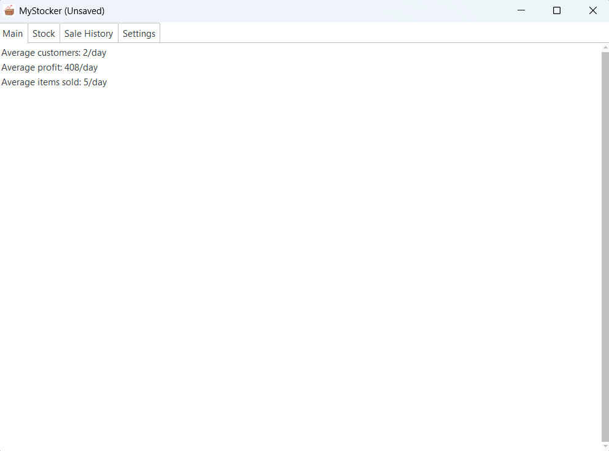
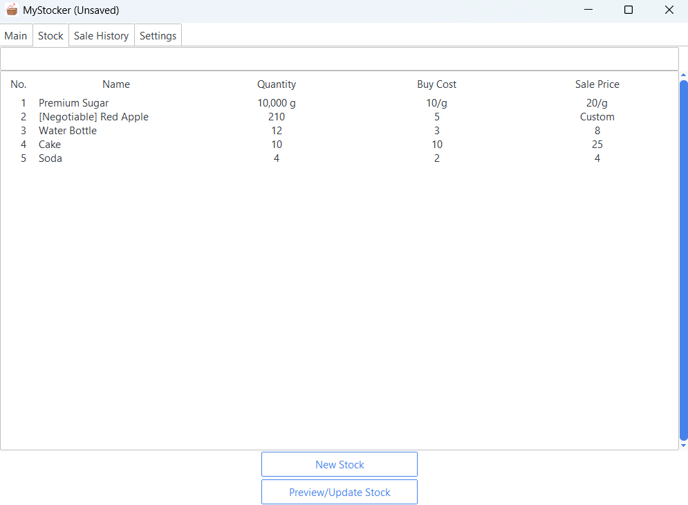
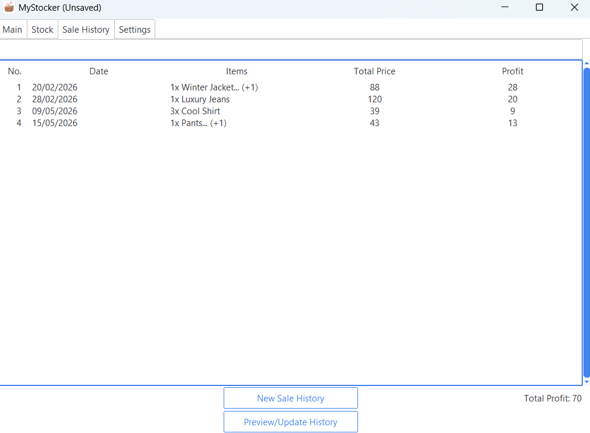

This app transforms common inconveniences that small business owners face when managing their products and sales into a quick and simple system rather than relying on manual effort.

**MyStocker** is a desktop application designed to manage product inventory, record sales transactions, and automate business calculations through simple data input.

## Key Features

- Three pricing models: Fixed, Unit-Measured, and Custom (Negotiable)
- Flexible data import and export using JSON
- Automated business calculations, such as profit and average customers per day

## Built With

- Python
- ttkbootstrap: user interface
- JSON: data storage and import/export
- datetime: date and time handling
- os: file and directory handling
- copy: handling reusable data structures

## Future Improvements

- Automated data visualization and diagrams
- Flexible date management for business data analysis by selecting specific days, months, or years

## Screenshots

### Main Interface

### Inventory

### Sales History

